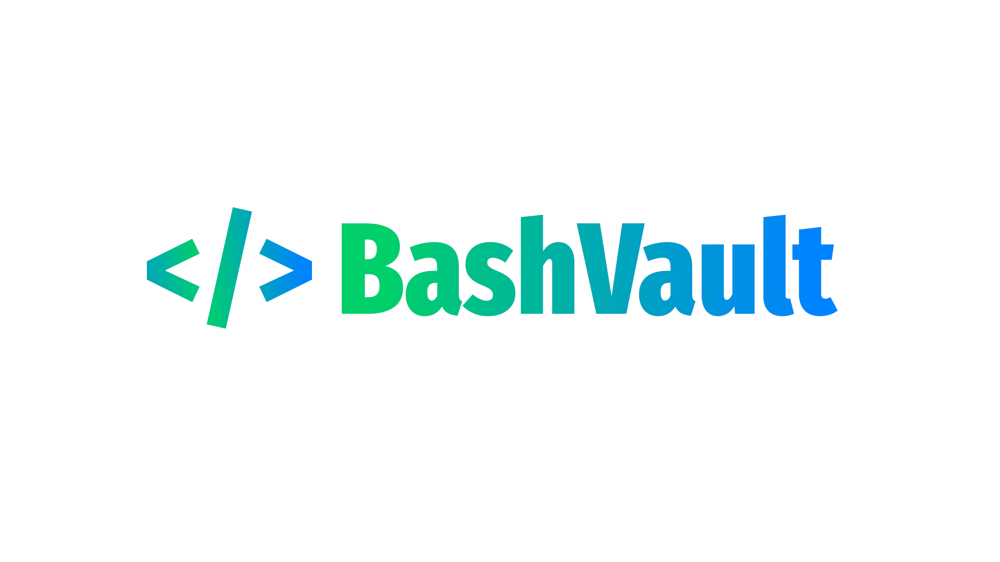
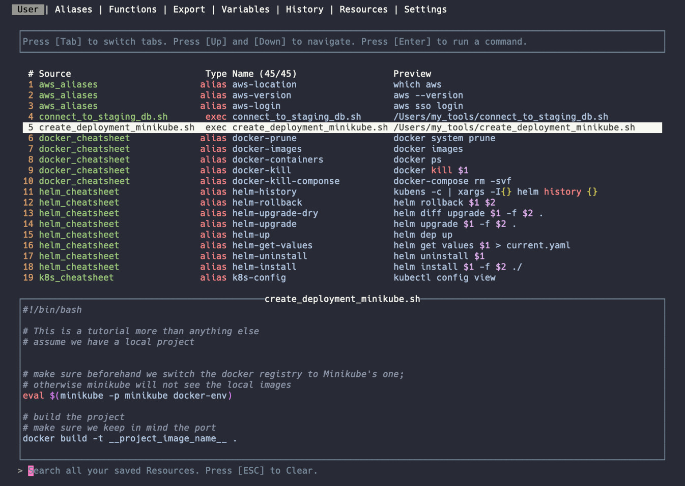

This is the public Git repository for [BashVault](https://bashvault.app). 

## Overview

BashVault is a lightweight TUI (terminal UI) app that runs in full screen mode in your chosen emulator.

It might be right for you if:
- you spend too much time browsing your terminal history trying to find past commands
- you reach out to Google with questions like: how do I get a PID based on a port? how do I log a Docker container? how do I apply a Helm change?
- you forget exactly the right parameters for that useful command
- you're new to a tool like Kubernetes, Docker, etc and you'd like help taming their myriad commands
- you have scripts to connect to remote databases, pull down images and pull up virtual machines and you'd like to have them at the tip of your fingertips
- and many many more

BashVault helps you with all of these issues by becoming a central respository of all your scripts and commands.

It allows you to add local or remote resources, keep them in sync easily, manage them using a visual interface, and run them by simply pressing [ENTER].

In addition, it's going to show you all of the aliases, functions and variables present on your system.

Lastly, it can read your terminal history and help your find what you're looking for easily.

It's also safe and secure. Your data does not leave your machine and the app does not track you.

## More info

You can find available cheatsheets [here](https://github.com/gobi-tools/bashvault-public/tree/main/cheatsheets).

## Bug Reports & Features

You can use the [GitHub Issue tracker](https://github.com/gobi-tools/bashvault-public/issues) to inform us of any bugs or propose new features.

